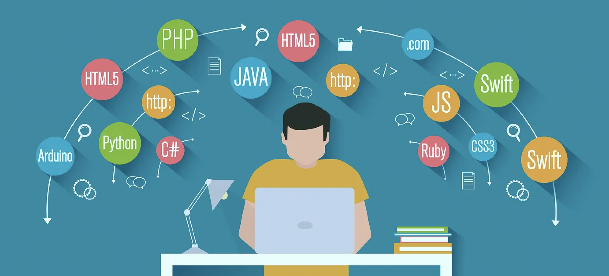
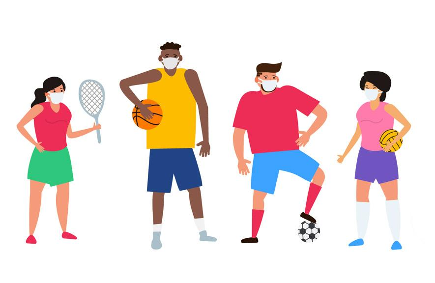

## Introduction to JavaScript 

I am just embarking on my journey to learning JavaScript, and so far I am impressed. Coming into ICS 314 (Software Engineering)
I have a strong background in coding in Python, C, C++, and Java. The first language I was introduced to was Java. I found this language 
very hard to learn as the syntax and hierarchy rules are rigid. However, after two semesters of coding in Java I found learning other languages (C, C++, and Python) to be much easier. I am the most comfortable with programming in Python, as I use it very often in my astronomy courses and my research. 
So far, I think that javascript is like a second cousin to languages like Java and Python, it is similar but has a few different characteristics. 

## Why is JavaScript Different?

The most interesting difference between JavaScript and the other languages I know is how it handles functions. In javascript "functions are first class", meaning that they can be treated like variables or a data type. This way of handling functions allows them to be generated dynamically at runtime and enables a more concise/simple way to use functions. Some other differences between javascript and other programming languages are that heterogeneous collections are allowed (collections may have multiple data types within them) and objects are equivalent to JSON (JSON strings are javascript objects). These key differences and many others make JavaScript a very efficient and attractive language for software development. 

## Athletic Software Engineering 

Does practice make perfect? Yes...well almost perfect! I believe that if you dedicate time outside of class to practice the skills that you are learning, you will do and learn better in the future. Part of my confidence in this practice comes from my experience playing volleyball. Specifically, when I was just starting to play volleyball in elementary school learning how to serve the ball was the main focus of most of the practices. After every practice, our coach would tell us to practice tossing the ball for our serve 100 times at home. When we would come back to practice the following day we had to show our coach our toss and serve the ball. It was always obvious who had put in the work at home the previous day and who hadn't. 

Like volleyball, programming in JavaScript requires skills that you have to practice to be successful. For this reason, I find the practice WODs (workout of the day) to be very useful. They provide us the opportunity to practice our programming and critical thinking skills at home before we are tested, like practicing before a game. 

