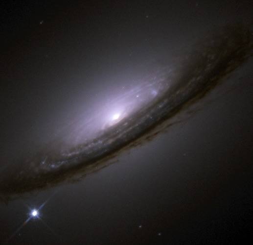

Supernovae are luminous explosions of stars that can be seen billions of light years away. 
Scientists study these events to learn more about the history and expansion of the universe. 
The James Webb Space Telescope (JWST) was launched on December 25, 2021 and with its large 6.5-meter 
mirror and ability to measure longer wavelengths of infrared light, we can see farther into the universe 
than ever before. 

Here we trained a convolutional neural network (CNN) to spot supernovae on mock JWST data from Vela Cosmological
Simulations. We generated two nearly identical sets of mock images, with and without noise. For every image in 
each set, we created four copies with different NIRCam bandpass filters (F115W, F150W, F277W, F444W). 
The presence and positions of the planted supernovae were randomly chosen, but consistent between each copy. 
For a sanity check, we use the set without noise as an idealized test (data for images without noise is not given). 

In this figure, the numbers above each image contain information regarding whether a supernova was planted or not and the network’s best guess at if one was present. The right-most number indicates if a supernova was planted on the image. The number 0 indicates that no supernova was planted and the number 1 indicates that one was. The left-most number represents the network’s prediction of there being a supernova. Values closer to 1 tell us that the network found a higher probability of there being a supernova, while smaller numbers indicate a lower probability.

Here we display the efficiency of our CNN in a confusion matrix. We found that our network did not identify a supernova when none was planted with a 0.98 percent accuracy (top right), identified a supernova when none was planted with a 0.02 percent accuracy (top left), did not identify a supernova when one was planted with a 0.02 percent accuracy (bottom right corner) and finally did identify a supernova when one was planted (bottom left). Our results do suggest that the network is efficient at spotting supernovae on images of galaxies.

This project is a part of the current research I am conducting with Dr. David Rubin. I got the opportunity to present these findings at the Undergraduate Showcase at the University of Hawaii at Manoa. 

