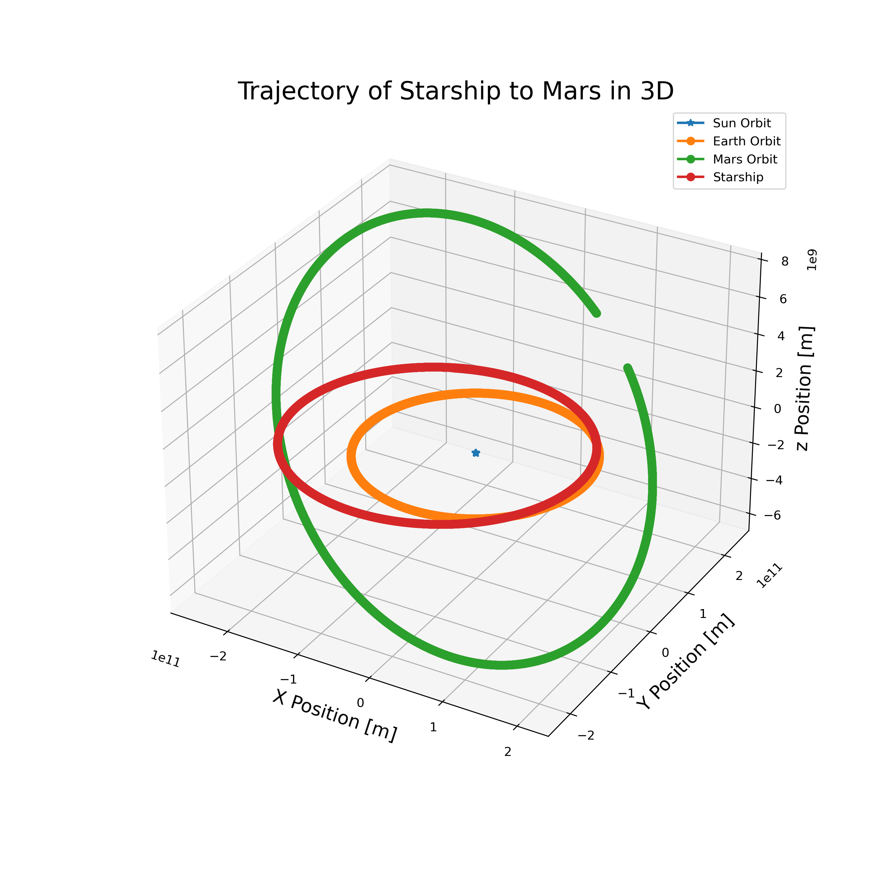

Mars is a valuable site for space exploration. From 1964, with the first successful mission to Mars, 
to the present-day we've sent numerous vehicles into space to study the geography, evolution and are even 
searching for signs of life on Mars. So far there have been 50 missions to Mars and only a fraction of them 
have been successful. These missions usually cost hundreds of millions of dollars, so it is important that 
scientists know the exact trajectory of their vehicle to the target (increasing the likelihood of a successful 
mission).

This project uses the Runge-Kutta method to model the trajectory of SpaceX's Starship in a round-trip 
flyby mission to Mars. We first use the Runge-Kutta method to model the orbits of the Sun, Mercury, Venus, Earth, 
Mars, Jupiter, Saturn, Uranus, and Neptune. (We exclude Pluto from our calculations due to its extremely small 
impact on our spacecraft's trajectory.) We initialize the positions of all planets using the NASA Jet Propulsion 
Laboratory's (JPL) Horizons Systems ephemeris tool. To model a realistic round-trip flyby flight 
to Mars, we determine an ideal date to exit Earth's orbit using the NASA Ames Research Center's Trajectory 
Search. This source also supplies the required additional velocity to exit Earth's sphere of 
influence and the angle at which it should be applied. The goal of this project was to model the motions 
of main solar system planets using the Runge-Kutta method and compute their gravitational forces using Newton's 
laws of motion and universal gravitation. We finally map the trajectory of SpaceX's Starship in a round-trip flyby
mission to Mars using the Runge-Kutta method and the suggested parameters. 

This project served as my final creative project for my computational physics class (PHYS 305). Though I found this project very difficult to complete, I learned many scientific computing skills in the process. For example I learned how to use the Runge-Kutta method to find the trajectory of a projectile in space. I also gained experience using resources like the NASA Jet Propulsion Laboratory's (JPL) Horizons Systems ephemeris tool and NASA Ames Research Center's Trajectory Search.

