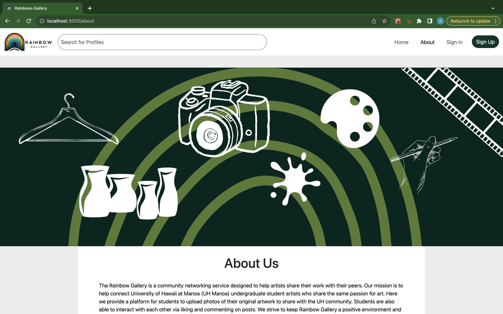
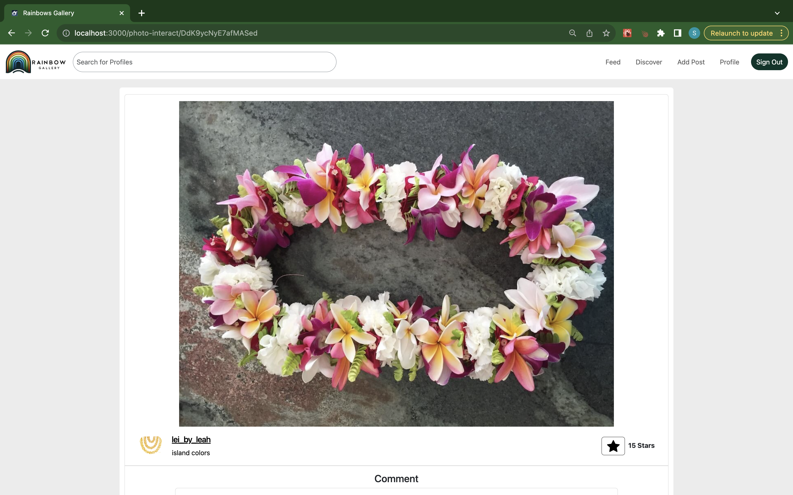
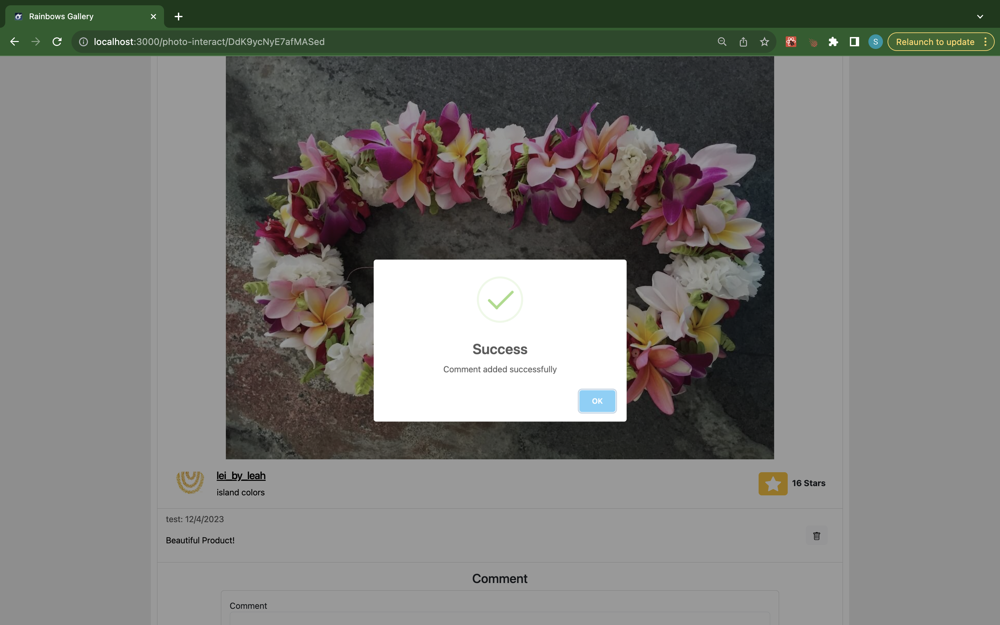
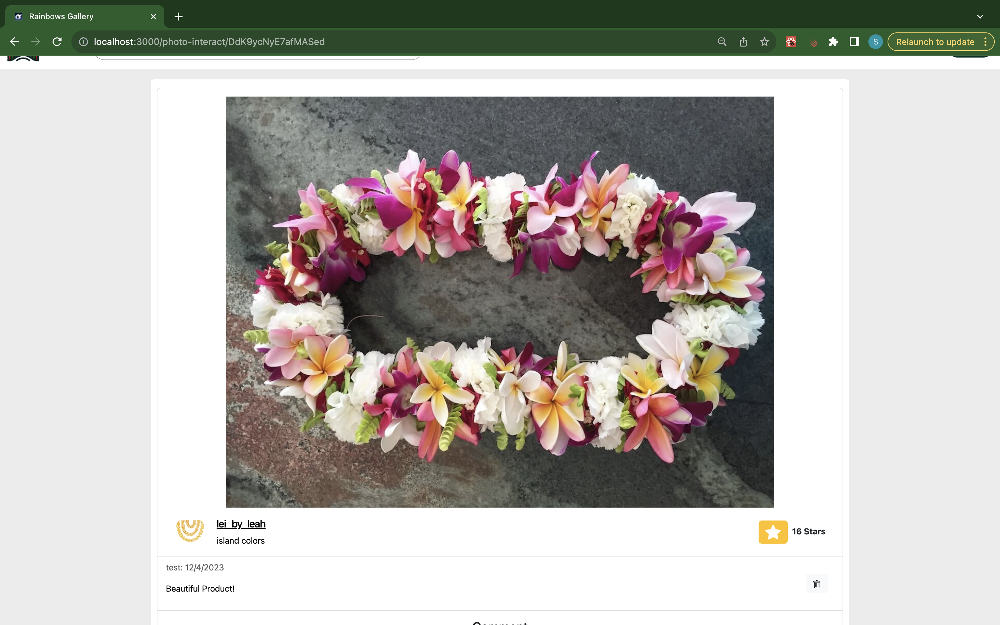

## The Vision:
The objective of the project was to create a public online space where UH students interested in art can share their work with other individuals. Here we provide students with an easy-to-use application that allows students to post pictures of their original work, like, comment, and follow other students.

## Working with a Team
As said in the project description, I worked as a part of a 4-person team in creating this application. As a group we utilized issue-driven project management (IDPM), in which tasks/issues were divided evenly amongst the group routinely. Each task would take a member 3-4 days to complete and would be explicitly documented as a GitHub issue. Every member would have two tasks to work on in a given week, so about 6 tasks were completed per person in total. Smaller tasks that required less than a couple of hours were not documented.

## My Contribution
My first two tasks, associated with [M1](https://github.com/orgs/rainbows-gallery/projects/2/views/1?layout=board), were to create an about page and a photo interact page.

On the About page, one can find key information about the web application. Here we introduce the application and explain how to use it.

When an image on the home page, user feed page, or profile page is clicked on the user is navigated to the photo interact page. Here the user can view the image on a larger scale and see the post's owner and caption.

In the next set of tasks, associated with [M2](https://github.com/orgs/rainbows-gallery/projects/3), I implemented updates to the landing page and created a comments database system.

On the landing page, I fixed the image spacing so that the posts were distributed evenly on the screen.

To implement comment functionality, I created a database to store all the comments associated with a post and created a form to add a comment on the photo interaction page. Each comment is tagged with its owner and when it was posted. I also enable the comment's owner, the post's owner, and an admin account to delete a comment.

My last two major tasks, associated with [M3](https://github.com/orgs/rainbows-gallery/projects/4), were to create default data and collect community feedback. To make the app appear as if it was being used I created 12 default accounts with realistic mock data. Making the app populated was important so that reviewers of the app could see how it should be used. To get community feedback, I created a [google forum](https://docs.google.com/forms/d/e/1FAIpQLSfCM0gscGfqH5AJ39ZU-yCABw_cPrNb8dPhPYlrxGMVKL5V0w/viewform?usp=sf_link) for UH students to complete while testing out our application. From the responses we received, we got valuable insight into what final touches we should implement to make the app as successful as possible.

[CLICK HERE](https://rainbows-gallery.github.io/) to learn more about this project.

[CLICK HERE](http://143.198.63.208/) to go to the deployed version of this project.

